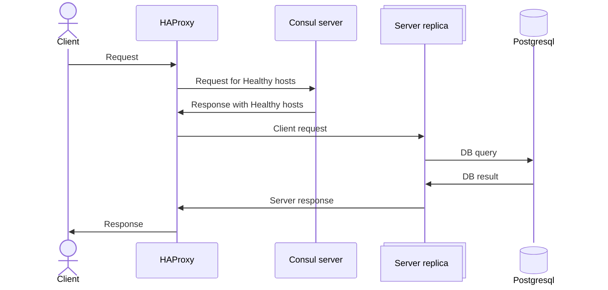

# Test task for EffectiveMobile company

## Задача
Написать CREST-API сервер, который будет отвечать за общение с Postgresql датабазой с поддержкой CRUDL операций
#### Доп. Условия:

- Должна быть ручка отвечающая за получение суммы стоимостей подписок пользователя в определенном сервисе за некоторый период
- Принятие и передача времени должна происходить в формате <b>ММ-ГГГГ</b>
- Код должен быть покрыт логами
- Запуск должен происходить посредством docker-compose
- Должна быть реализована поддержка миграций для датабазы
- Конфиги должны быть в .env/yaml файлах
- Должна быть swagger документация

## Архитектурные решения

- Добавил поддержку репликации, просто так.
- Использовад haproxy проксирования запросов между репликами так как он самый быстрый из мне известных, а сервер не требует сложного конфига.
- Использовал Consul в качестве сервиса узнавания серваисов, так как у него есть нативная поддержка Go, а также потому как я наиболее знаком с этой технологией
- Go был языком как часть задания. Также использовал его для реализации миграций и автогенерации swagger
- Postgresql также является частью задания

#### Схема работы

## Task
Task is create CRUDL REST-API server to manage work with subscriptions on postgresql database.

#### Addition feature:

- Server must have addition handler that response for function that will get sum of subscription prices with exact uuid + service name in some time period
- Time must be supported only in <b>MM-YYYY</b>
- All code must be cowered by logs
- Server must be started via docker-compose
- System must support db migrations
- Configs must be in .env/yaml files
- Must be swagger documentation

## Architecture

- Docker replica support is just for fun
- Used haproxy for request/response proxy cause it fast and there are no need in complex condig.
- Used Consul for service discovery because this service has native support for go. Also cause this is tech with i most familiar
- Go as language for server is part of task, also used it for swagger generation and migration
- Postgre is also part of task

#### Work scheme
